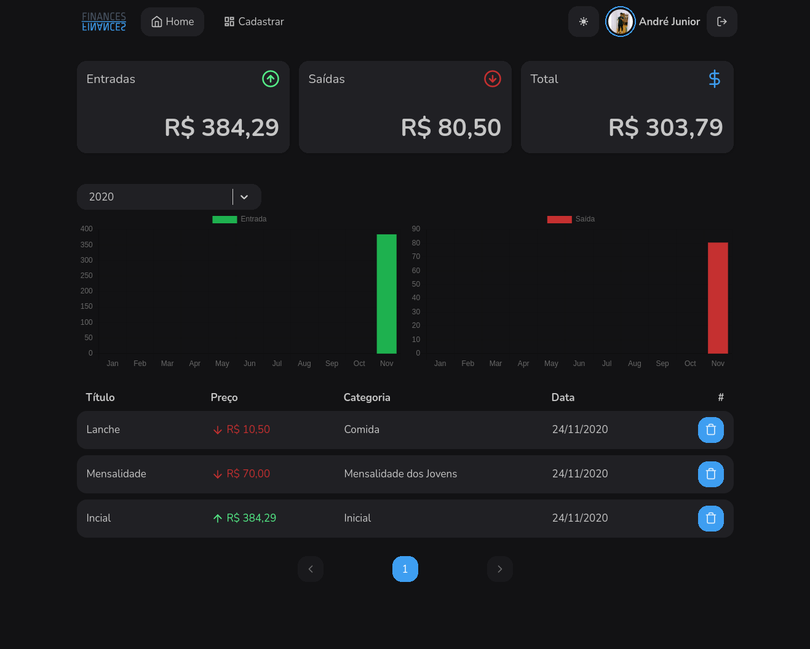
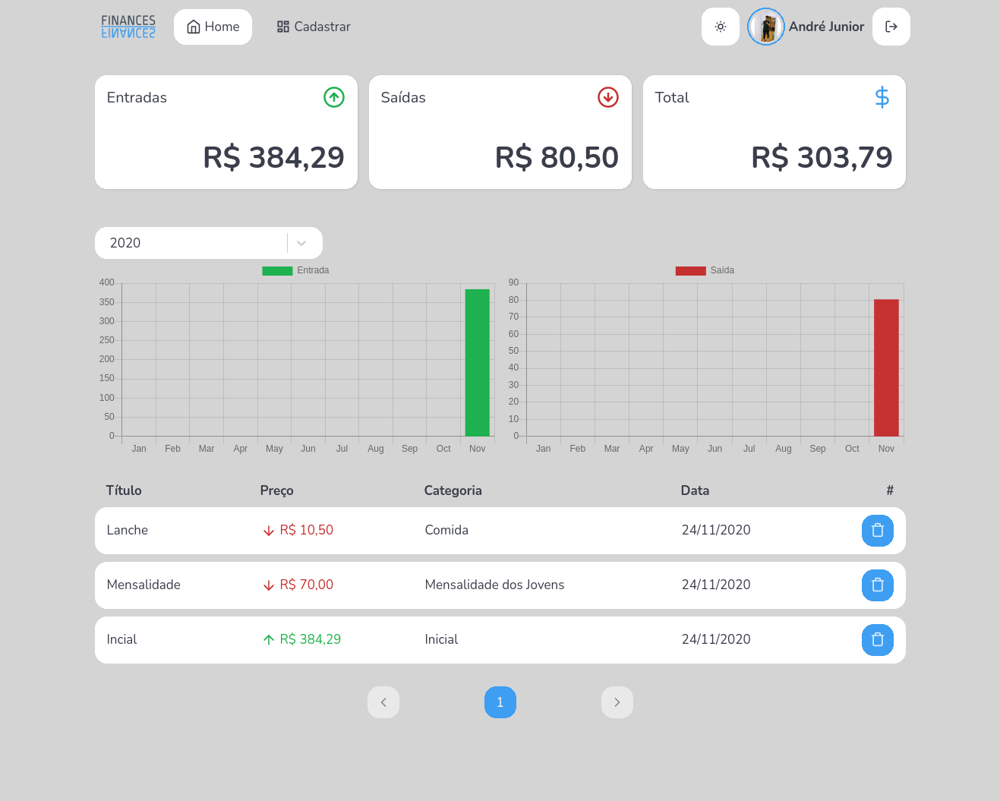
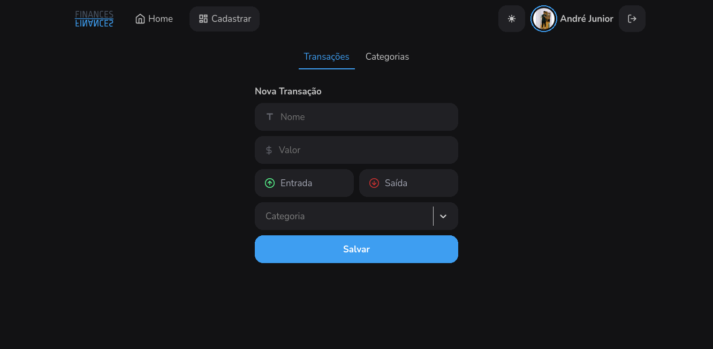

<h1 align="center">
    Point Counter
</h1>

  <a href="#-tecnologias">Tecnologias</a>&nbsp;&nbsp;&nbsp;|&nbsp;&nbsp;&nbsp;
  <a href="#-projeto">Projeto</a>&nbsp;&nbsp;&nbsp;

 

  

## 🚀 Tecnologias

Esse projeto foi desenvolvido com as seguintes tecnologias:

- [React](https://reactjs.org)
- [StyledComponents](https://styled-components.com)
- [Typescript](https://www.typescriptlang.org/)
- [Charts](https://www.chartjs.org)

## 💻 Projeto

No bootcamp GoStack da Rockeseat, devenvolvemos uma aplicação GoFinances, e afim de aperfeiçoar o conhecimento adquirido, resolvi fazer um upgrade na aplicação, assim surgiu o Finances.

Link para o [backend](https://github.com/andrejr971/backend-finances2.0)

  

  

---

Feito by André Junior :wave: [portifólio](https://andrejr.dev)